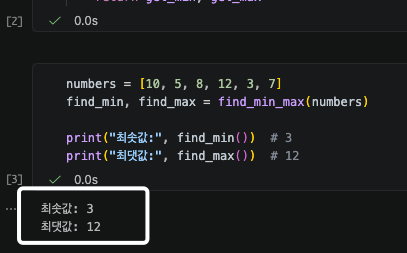
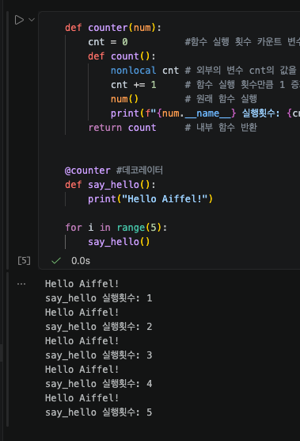
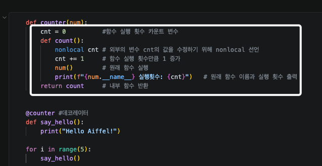

# AIFFEL Campus Online Code Peer Review Templete
- 코더 : 김수경
- 리뷰어 : 김민욱


# PRT(Peer Review Template)
- [x]  **1. 주어진 문제를 해결하는 완성된 코드가 제출되었나요?**
    - 두 문제 모두 요구한 최종 출력이 정확히 나오는 완성 코드가 제출되었습니다.  
    - **근거 (문제 1 — 클로저로 최댓값/최솟값):** `numbers = [10, 5, 8, 12, 3, 7]` 입력에 대해 출력이 요구사항과 일치합니다.    
        
        `min_value`/`max_value`를 반환하지 않고 `get_min`/`get_max` 두 내부 함수만 반환하여 변수를 외부에 노출하지 않는다는 조건도 충족했습니다.  
    - **근거 (문제 2 — 호출 횟수 데코레이터):** `say_hello`를 5번 호출했을 때 실행 횟수가 1→5로 누적 출력되어 기대 출력과 정확히 일치합니다.   
        

- [x]  **2. 전체 코드에서 가장 핵심적이거나 가장 복잡하고 이해하기 어려운 부분에 작성된
주석 또는 doc string을 보고 해당 코드가 잘 이해되었나요?**
    - 이 퀘스트의 핵심은 **`nonlocal`로 외부 함수의 변수를 내부 함수가 참조/수정하는 클로저 동작**인데, 두 문제 모두 바로 그 지점에 주석이 달려 있어 이해가 잘 됐습니다.  
        

- [X]  **3. 에러가 난 부분을 디버깅하여 문제를 해결한 기록을 남겼거나
새로운 시도 또는 추가 실험을 수행해봤나요?**
    - 해당없음

- [x]  **4. 회고를 잘 작성했나요?**
    - 노트북 마지막에 회고가 작성되어 있어, 어렵게 느낀 점과 그래도 배운 내용으로 구조는 이해됐다는 소감이 담겨 있습니다.
        > "코드가 짜는게 어려워서 직접하는건 한계가 있었지만 배운내용이 나와서 코드 구조는 어느정도 이해가 되는거 같다."

- [x]  **5. 코드가 간결하고 효율적인가요?**
    - 두 문제 모두 군더더기 없이 간결하고, 클로저/`nonlocal` 패턴을 적절히 함수화했습니다. 리스트를 한 번만 순회(O(n))하여 효율도 좋습니다.
    - 다른팀들것도 좀 보고 검색도 좀 해보니 데코레이터의 안쪽 함수에는 인자를 넣는것이 일반적인 문법이라고 하네요. 그것을 첨부해봅니다.
        ```python
        def counter(func):
            cnt = 0
            def count(*args, **kwargs):
                nonlocal cnt
                cnt += 1
                result = func(*args, **kwargs)
                print(f"{func.__name__} 실행횟수: {cnt}")
                return result
            return count
        ```  
    - 참고: functools.wraps (데코레이터에서 원래 함수의 __name__/__doc__ 보존): https://docs.python.org/ko/3/library/functools.html#functools.wraps


# 회고(참고 링크 및 코드 개선)
```
[리뷰어 회고]
- 클로저로 변수를 외부에 노출하지 않으면서 상태를 기억시키는 의도가 두 문제 모두 잘 구현되어 있는것 같습니다.
- 데코레이터의 *args/**kwargs 일반화를 이번 리뷰를 통해 알게 되었습니다.

[참고 링크]
- 파이썬 클로저/ nonlocal: https://docs.python.org/ko/3/reference/simple_stmts.html#nonlocal
- functools.wraps (데코레이터에서 원래 함수의 __name__/__doc__ 보존): https://docs.python.org/ko/3/library/functools.html#functools.wraps